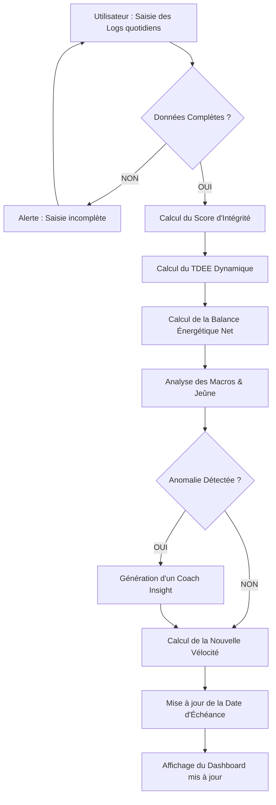

# 📄 Description du Processus (To-Be) : PulsePath Engine

## 1. Présentation du Flux Métier
Ce document modélise le processus cible (**To-Be**) du moteur PulsePath. L'objectif est de montrer comment la donnée brute saisie par l'utilisateur est transformée en insights stratégiques et en mise à jour de trajectoire.

---

## 2. Diagramme de Flux (Syntaxe Mermaid)

---

## 3. Détail des Étapes (Swimlanes)

### 👤 Ligne Utilisateur
*   **Action** : Saisit le poids, les calories, les macros, le sommeil et la fenêtre de jeûne.
*   **Contrainte** : Doit effectuer la saisie avant minuit pour valider le bonus "Intégrité".

### ⚙️ Ligne Système (Moteur PulsePath)
*   **Validation** : Vérifie que les données respectent les seuils de sécurité (ex: Calories > BMR).
*   **Calculs** :
    *   Applique la règle **RM-MET-01** pour ajuster le métabolisme selon les pas.
    *   Applique la règle **RM-VEL-01** pour recalculer la date de fin via la moyenne glissante (SMA 7j).
*   **Intelligence** : Croise les données (ex: impact d'un sommeil court sur la faim du lendemain) pour générer des recommandations personnalisées.

### 💾 Ligne Base de Données
*   **Action** : Archive les logs quotidiens et met à jour l'historique de vélocité pour les futurs calculs de tendance.

---

## 4. Analyse de la Valeur Ajoutée (Business Value)
Ce processus automatisé supprime la charge mentale de l'utilisateur. Au lieu de simplement stocker des chiffres, le système **interprète** la donnée. 

**Exemple d'optimisation :** Si le système détecte une baisse de vélocité, il n'attend pas que l'utilisateur s'en rende compte ; il propose immédiatement un ajustement via le "Coach Insight".
